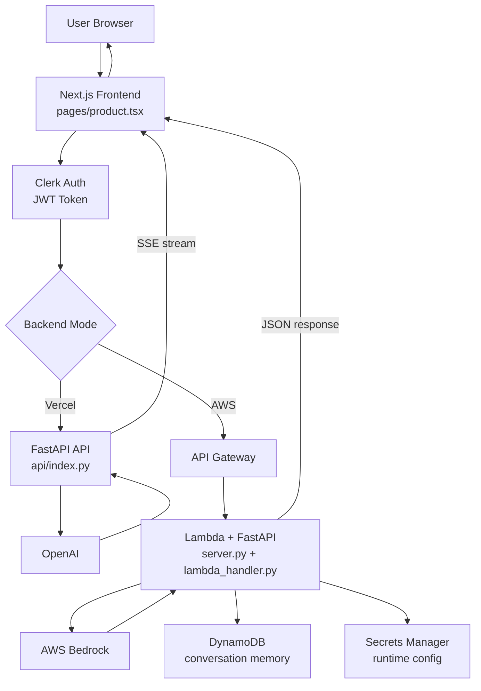

# JobCoach AI

JobCoach AI helps users tailor job applications from a job description and resume.

It generates:
- tailored resume bullets,
- a role-specific cover letter draft,
- interview preparation tips.

The frontend is built with Next.js and Clerk auth. The backend supports two modes:
- Vercel Python API (`api/index.py`) using OpenAI + SSE streaming.
- AWS Lambda (`server.py` + `lambda_handler.py`) using Bedrock + optional DynamoDB memory.

## Tech Stack

- Next.js (Pages Router), React, TypeScript
- Clerk authentication/subscription gating
- FastAPI (Python backend)
- OpenAI API (Vercel mode) or AWS Bedrock (AWS mode)
- Terraform for AWS infra (Lambda, API Gateway, S3, CloudFront, DynamoDB, Secrets Manager)

## Project Structure

- `pages/` - frontend pages (`index`, `product`, app wrappers)
- `components/` - shared UI components (pricing/paywall UI)
- `api/` - Vercel Python backend endpoint
- `infra/` - Terraform and Lambda packaging assets
- `server.py` - AWS-targeted FastAPI backend
- `lambda_handler.py` - Mangum adapter for Lambda
- `aws_secrets.py`, `dynamo_memory.py` - AWS runtime helpers

## Architecture Flowchart



## Local Development

### 1) Install frontend deps

```bash
npm install
```

### 2) Install Python deps for Vercel API runtime

```bash
pip install -r api/requirements.txt
```

### 3) Set environment variables

For local/Vercel-mode development, set at least:

```bash
OPENAI_API_KEY=...
CLERK_JWKS_URL=...
NEXT_PUBLIC_CLERK_PUBLISHABLE_KEY=...
CLERK_SECRET_KEY=...
```

### 4) Run the app

```bash
npm run dev
```

Open `http://localhost:3000`.

## Runtime Modes

### Vercel mode (default)

- Frontend calls `/api`.
- `api/index.py` validates input, verifies Clerk JWT, and streams response chunks.

### AWS mode

- Set `NEXT_PUBLIC_API_URL` to your API Gateway URL in the frontend environment.
- Frontend will call `${NEXT_PUBLIC_API_URL}/api` and expect JSON (non-streaming).
- Backend runs in Lambda via `server.py` and can persist sessions in DynamoDB.

## Build for AWS Static Hosting

`next.config.ts` switches behavior with `BUILD_FOR_AWS=true`:
- enables static export (`output: 'export'`)
- writes output to `out/` for S3/CloudFront hosting

Example:

```bash
BUILD_FOR_AWS=true npm run build
```

## Infrastructure (Terraform)

Terraform lives in `infra/` and provisions:
- Lambda + IAM
- API Gateway HTTP API
- S3 static website bucket
- CloudFront distribution
- DynamoDB table (conversation memory + TTL)
- Secrets Manager config secret

Typical flow:

```bash
cd infra
terraform init
terraform workspace new dev   # first time only
terraform workspace select dev
terraform apply
```

## Packaging Lambda

From project root:

- macOS/Linux:
```bash
bash infra/package.sh
```

- Windows PowerShell:
```powershell
.\infra\package.ps1
```

This creates `infra/lambda.zip` used by Terraform.

## Useful Commands

```bash
npm run dev
npm run build
npm run start
npm run lint
```

## Notes

- `secrets.py` is intentionally a placeholder to avoid naming conflicts with Python's built-in `secrets` module.
- Generated documentation artifacts are under `docs/`, `output/`, and `tmp/`.
